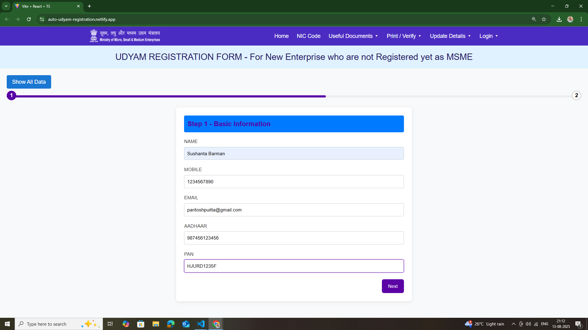
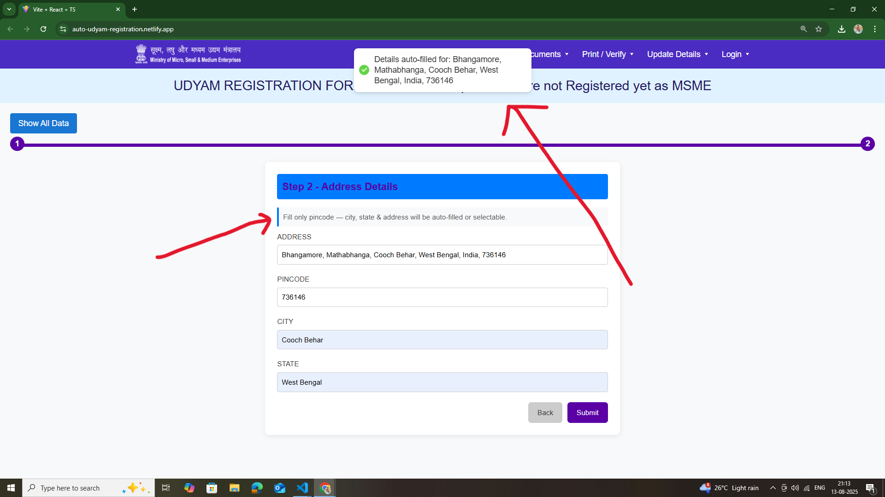
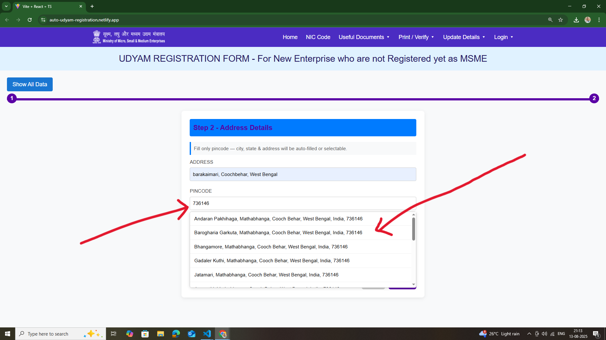
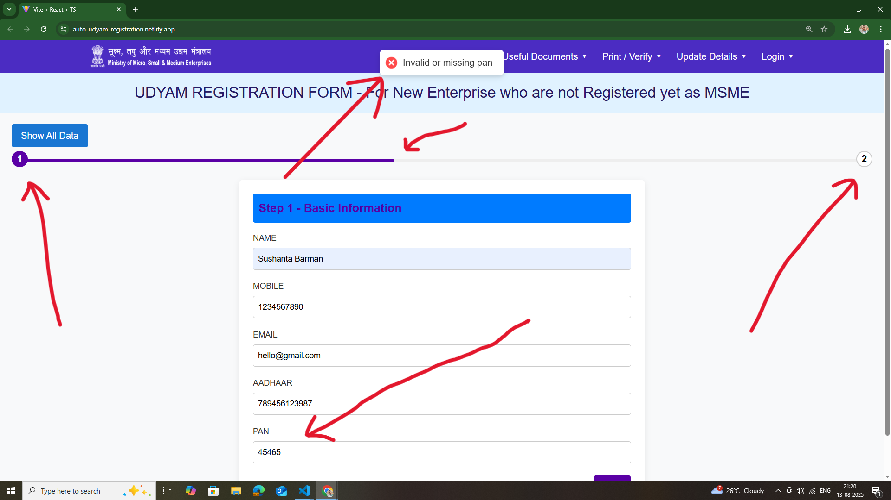
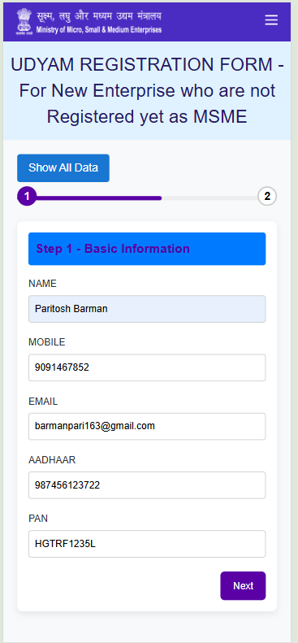
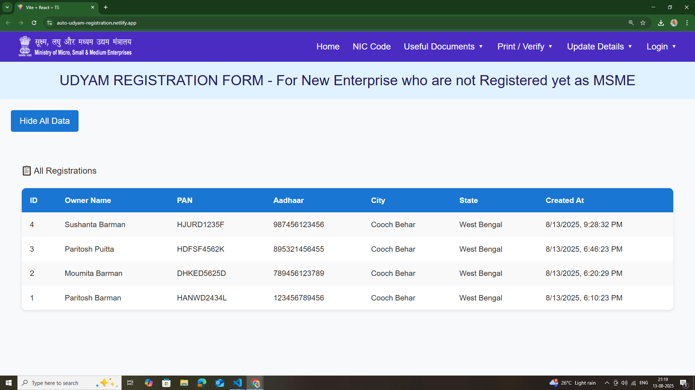

# 🚀 Auto Udyam Registration – Full Stack Project

A complete **Udyam Registration Automation** system built with **React (TypeScript)**, **Node.js (Express)**, **PostgreSQL**, and a **Python Web Scraper** for extracting form metadata.

---

## 🌐 Live Demo
🔗 **Frontend (Netlify)**: [https://auto-udyam.netlify.app](https://auto-udyam.netlify.app)  

---
## 🔗 Links

- **GitHub Repository:** [Auto-Udyam-Registration-project](https://github.com/ParitoshBarman/Auto-Udyam-Registration-project)
- **Backend API (Railway):** [https://auto-udyam-backend.up.railway.app](https://auto-udyam-backend.up.railway.app)
- **Scraper Code:** [View Scraper on GitHub](https://github.com/ParitoshBarman/Auto-Udyam-Registration-project/tree/master/scraper)

---
## 📌 Overview

This project replicates the **first two steps** of the Udyam Registration process from the official MSME portal, with:

* **Dynamic form rendering** using scraped form schemas
* **Backend API** for validation & data storage
* **Database integration** (PostgreSQL via Prisma)
* **Responsive & modern UI** with progress tracking

---

## ✨ Features

### 🔍 Web Scraper

* Scrapes **Step 1 & Step 2** of the official Udyam form
* Extracts **field names, labels, placeholders, validations** into JSON schemas
* Saves structured data in `scraper/output`

### 💻 Frontend

* **React + TypeScript + TailwindCSS**
* Fully **responsive** and mobile-friendly
* Real-time **PAN & Aadhaar validation**
* **Progress bar** to track registration steps
* **Toast notifications** for form feedback

### 🖥 Backend

* **Node.js + Express**
* REST API for form submission & data fetching
* Validation middleware using **express-validator**
* Data stored in **PostgreSQL** via **Prisma ORM**
* Unit & integration tests with **Jest** + **Supertest**

---

## 🛠 Tech Stack

**Frontend**


**Backend**


**Scraper**


---

## 📂 Project Structure

```
auto-udyam-registration-project
├── backend
│   ├── controllers
│   │   └── registrationController.js
│   ├── index.js
│   ├── middleware
│   │   └── validateRegistration.js
│   ├── package-lock.json
│   ├── package.json
│   ├── prisma
│   │   ├── migrations
│   │   │   ├── 20250812131453_init
│   │   │   │   └── migration.sql
│   │   │   ├── 20250812145333_add_pan_address_pincode
│   │   │   │   └── migration.sql
│   │   │   └── migration_lock.toml
│   │   └── schema.prisma
│   ├── prismaClient.js
│   ├── routes
│   │   └── registrationRoutes.js
│   ├── tests
│   │   ├── submitApi.test.js
│   │   └── validation.test.js
│   └── utils
│       └── validation.js
├── frontend
│   ├── README.md
│   ├── eslint.config.js
│   ├── index.html
│   ├── package-lock.json
│   ├── package.json
│   ├── public
│   │   ├── _redirects
│   │   ├── image.png
│   │   └── vite.svg
│   ├── src
│   │   ├── App.css
│   │   ├── App.tsx
│   │   ├── assets
│   │   │   └── react.svg
│   │   ├── components
│   │   │   ├── DataList.tsx
│   │   │   ├── Navbar.tsx
│   │   │   ├── ProgressBar.tsx
│   │   │   ├── Step1Form.tsx
│   │   │   ├── Step2Form.tsx
│   │   │   └── SuccessModal.tsx
│   │   ├── context
│   │   │   └── FormContext.tsx
│   │   ├── index.css
│   │   ├── main.tsx
│   │   ├── styles
│   │   │   ├── form.css
│   │   │   └── progressbar.css
│   │   └── vite-env.d.ts
│   ├── tsconfig.app.json
│   ├── tsconfig.json
│   │   ├── components
│   │   │   ├── DataList.tsx
│   │   │   ├── Navbar.tsx
│   │   │   ├── ProgressBar.tsx
│   │   │   ├── Step1Form.tsx
│   │   │   ├── Step2Form.tsx
│   │   │   └── SuccessModal.tsx
│   │   ├── context
│   │   │   └── FormContext.tsx
│   │   ├── index.css
│   │   ├── main.tsx
│   │   ├── styles
│   │   │   ├── form.css
│   │   │   └── progressbar.css
│   │   └── vite-env.d.ts
│   ├── tsconfig.app.json
│   ├── tsconfig.json
│   │   │   ├── Navbar.tsx
│   │   │   ├── ProgressBar.tsx
│   │   │   ├── Step1Form.tsx
│   │   │   ├── Step2Form.tsx
│   │   │   └── SuccessModal.tsx
│   │   ├── context
│   │   │   └── FormContext.tsx
│   │   ├── index.css
│   │   ├── main.tsx
│   │   ├── styles
│   │   │   ├── form.css
│   │   │   └── progressbar.css
│   │   └── vite-env.d.ts
│   ├── tsconfig.app.json
│   ├── tsconfig.json
│   │   │   ├── Step2Form.tsx
│   │   │   └── SuccessModal.tsx
│   │   ├── context
│   │   │   └── FormContext.tsx
│   │   ├── index.css
│   │   ├── main.tsx
│   │   ├── styles
│   │   │   ├── form.css
│   │   │   └── progressbar.css
│   │   └── vite-env.d.ts
│   ├── tsconfig.app.json
│   ├── tsconfig.json
│   │   ├── styles
│   │   │   ├── form.css
│   │   │   └── progressbar.css
│   │   └── vite-env.d.ts
│   ├── tsconfig.app.json
│   ├── tsconfig.json
│   │   └── vite-env.d.ts
│   ├── tsconfig.app.json
│   ├── tsconfig.json
│   ├── tsconfig.node.json
│   └── vite.config.ts
└── scraper
│   ├── tsconfig.node.json
│   └── vite.config.ts
└── scraper
    ├── README.md
    ├── fetch_html.py
└── scraper
    ├── README.md
    ├── fetch_html.py
    ├── README.md
    ├── fetch_html.py
    ├── output
    │   ├── step1_schema.json
    │   └── step2_schema.json
    ├── parse_helpers.py
    ├── fetch_html.py
    ├── output
    │   ├── step1_schema.json
    │   └── step2_schema.json
    ├── parse_helpers.py
    ├── output
    │   ├── step1_schema.json
    │   └── step2_schema.json
    ├── parse_helpers.py
    │   └── step2_schema.json
    ├── parse_helpers.py
    ├── requirements.txt
    ├── requirements.txt
    ├── scrape_step1.py
    ├── scrape_step2.py
```

---

## ⚙️ Installation & Setup

### 1️⃣ Clone the repository

```bash
git clone https://github.com/ParitoshBarman/Auto-Udyam-Registration-project.git
cd Auto-Udyam-Registration-project
```

### 2️⃣ Setup Backend

```bash
cd backend
npm install
cp .env.example .env  # Add DB credentials here

# Migrate database
npm run prisma:migrate

# Start server
npm run dev
```

Backend runs at: [http://localhost:4000](http://localhost:4000)

### 3️⃣ Setup Frontend

```bash
cd ../frontend
npm install
npm run dev
```

Frontend runs at: [http://localhost:5173](http://localhost:5173)

### 4️⃣ Setup Scraper

```bash
cd ../scraper
pip install -r requirements.txt

# Run Step 1 Scraper
python scrape_step1.py --url "https://udyamregistration.gov.in/UdyamRegistration.aspx" --out output/step1_schema.json

# Run Step 2 Scraper
python scrape_step2.py --url "https://udyamregistration.gov.in/UdyamRegistration.aspx" --out output/step2_schema.json
```

## 🔗 API Endpoints

* **POST** `/api/registration/submit` – Submit registration data
* **GET** `/api/registration/all` – Get all registrations

**Example request:**

```json
POST /api/registration/submit
{
  "ownerName": "John Doe",
  "pan": "ABCDE1234F",
  "aadhaar": "123412341234",
  "mobile": "9876543210",
  "city": "Kolkata",
  "state": "West Bengal",
  ...
}
```

## 🧪 Testing

### Backend Tests

```bash
cd backend
npm run test
```

## 🚀 Deployment

* **Frontend:** Netlify
* **Backend:** Railway


---
## ⚙️ Full Project Setup

### 1️⃣ Backend Setup
```bash
cd ../backend
npm install
cp .env.example .env   # Add your PostgreSQL credentials here

# Run database migrations
npm run prisma:migrate

# Start backend server
npm run dev
```
Backend will run at: [http://localhost:4000](http://localhost:4000)

---

### 2️⃣ Frontend Setup
```bash
cd ../frontend
npm install
npm run dev
```
Frontend will run at: [http://localhost:5173](http://localhost:5173)

---

### 3️⃣ Scraper Setup
```bash
cd ../scraper
pip install -r requirements.txt
```

---


## 📸 Screenshots

| Screenshot Name      | Description | Screenshot |
|----------------------|-------------|------------|
| Step1_form           | First step of Udyam Registration — basic details including Aadhaar & OTP validation. |  |
| Step2_form           | Second step of Udyam Registration — PAN validation and additional enterprise details. |  |
| suggest_address      | Auto-fill suggestion feature for city/state fields based on PIN code API. |  |
| successful_submit    | Confirmation popup after successful form submission to backend. |  |
| live_form_validation | Demonstrates real-time validation for Aadhaar, PAN, and other fields based on predefined rules. |  |
| mobile_view          | Mobile-first responsive layout of Step 1 form ensuring usability on small screens. |  |
| All_data             | Displays all stored form submission records from the database in a table format. |  |

---


## 👨‍💻 Author

**Paritosh Barman**

* 📧 Email: [barmanpari163@gmail.com](mailto:barmanpari163@gmail.com)
* 🔗 GitHub: [ParitoshBarman](https://github.com/ParitoshBarman)
